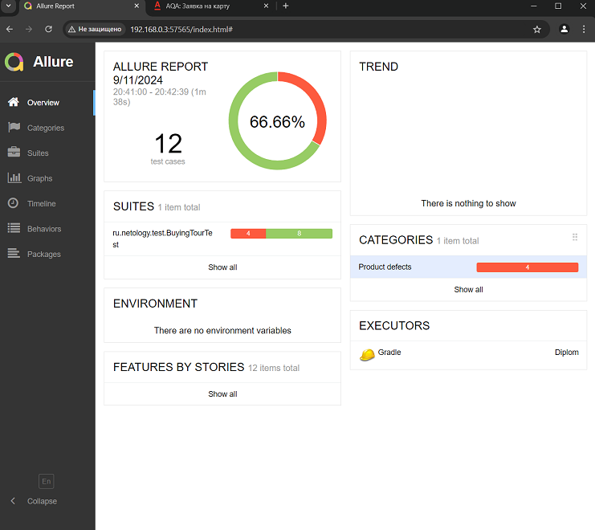
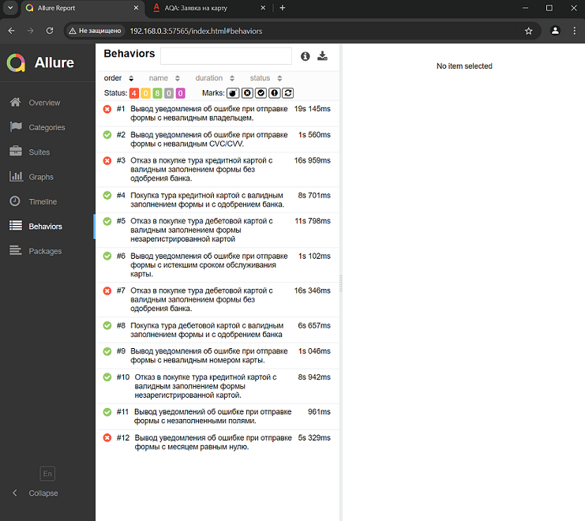

# Отчет по итогам тестирования
Отчет по итогам тестирования веб-сайта для покупки тура либо по дебетовой карте, либо в кредит.

Проверено 12 тест-кейсов автотестами

Результаты тестирования: 66,66% кейсов без выявленных ошибок, в 33,33% кейсах обноружены ошибки

Выявленные ошибки в issue:
1) https://github.com/AlexanderIss/Diplom/issues/10
2) https://github.com/AlexanderIss/Diplom/issues/9
3) https://github.com/AlexanderIss/Diplom/issues/8
4) https://github.com/AlexanderIss/Diplom/issues/7

## Общие рекомендации:
- Изменить уведомение при отправке формы с картой с статусом "DECLINED" 
- Запретить ввод пользователю в поле "Владелец" все символы кроме "-"," " и Латиницы
- Выводить ошибку если пользователь ввел в поле "месяц" ноль 